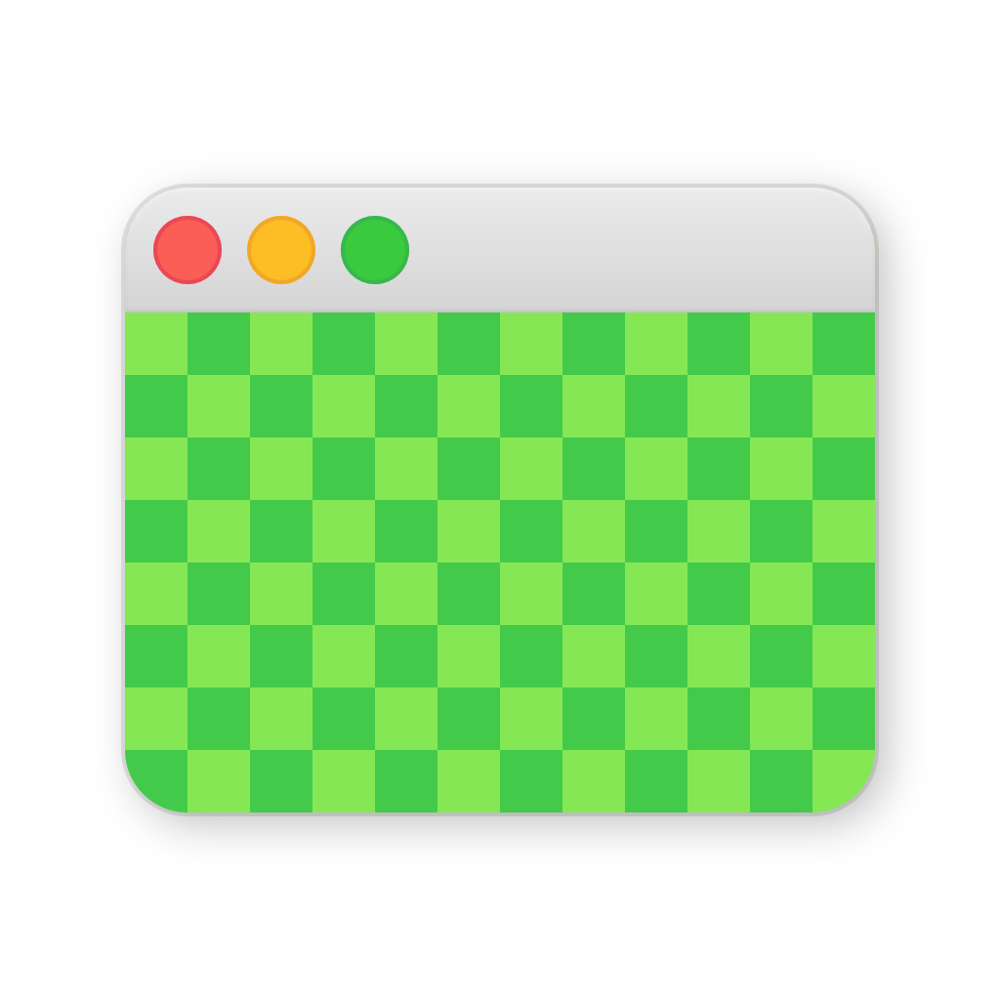

	

# retiNO

Just say **"no!"** to Retina with retiNO! Makes Minecraft render at half resolution on Retina displays, which is probably enough for you anyway and has the advantage of not murdering your performance and its extended family.

Download in [the releases section](https://github.com/juliand665/retiNO/releases) or on [CurseForge](https://www.curseforge.com/minecraft/mc-mods/retino).

Note: This mod <u>only affects macOS</u> (although it runs just fine on other platforms; it simply doesn't do anything), because there's an incredibly simple way to do what it does on there. There doesn't seem to be something like that on other platforms, but you can get pretty close with [Resolution Control](https://github.com/juliand665/Resolution-Control).

